## 스프링 데이터 Common: Web

### DomainClassConverter

#### 스프링 Converter
- [참고문서](https://docs.spring.io/spring-framework/docs/current/javadoc-api/org/springframework/core/convert/converter/Converter.html)

#### DomainClassConverter
- 사용 전
    ```
    @GetMapping("/posts/{id}")
        public String getAPost(@PathVariable Long id) {
            Optional<Post> byId = postRepository.findById(id);
            Post post = byId.get();
            return post.getTitle();
        }
    ```
    
- 사용
    - 해당아이디 값으 찾아서 Domain객체로 변환해준다.
        ```
        @GetMapping("/posts/{id}")
            public String getAPost(@PathVariable(“id”) Post post) {
                return post.getTitle();
            }
        ```

- Formatter
    - 문자열 기반
    - 문자열 -> 다른타입
    - 어떤타입 -> 문자열 프린팅
<br><br>

### Pageable과 Sort 매개변수
#### 스프링 MVC HandlerMethodArgumentResolver
- 스프링 MVC 핸들러 메소드의 매개변수로 받을 수 있는 객체를 확장하고 싶을 때 사용하는 인터페이스
- [참고문서](https://docs.spring.io/spring/docs/current/javadoc-api/org/springframework/web/method/support/HandlerMethodArgumentResolver.html)

#### 페이징과 정렬 관련 매개변수
- page: 0부터 시작.
- size: 기본값 20.
- sort: property,property(,ASC|DESC)
- 예) sort=created,desc&sort=title (asc가 기본값)

#### 예제
- 컨트롤러
    ```
    @GetMapping("/posts")
        public Page<Post> getPost(Pageable pageable){
            return postRepository.findAll(pageable);
    }
    ```
- test
    ```
     @Test
     public void getPosts() throws Exception {
         Post post = new Post();
         post.setTitle("jpa");
         postRepository.save(post);
 
         mockMvc.perform(get("/posts/")
                 .param("page", "0")
                 .param("size", "10")
                 .param("sort", "created,desc")
                 .param("sort", "title"))
                 .andDo(print())
                 .andExpect(status().isOk())
         .andExpect(jsonPath("$.content[0].title", is("jpa")));
     }
    ```
<br><br>

### HATEOAS
#### Page를 PagedResource로 변환하기
- 일단 HATEOAS 의존성 추가 (starter-hateoas)
- 핸들러 매개변수로 PagedResourcesAssembler

#### 예제
- 컨트롤러
    ```
     @GetMapping("/posts")
     public PagedResources<Resource<Post>> getPosts (Pageable pageable, PagedResourcesAssembler<Post> assembler){
         return assembler.toResource(postRepository.findAll(pageable));
     }
    ```
- test
    ```
     @Test
     public void getPosts() throws Exception {
         createPost("jpa");
 
 
         mockMvc.perform(get("/posts/")
                 .param("page", "0")
                 .param("size", "10")
                 .param("sort", "created,desc")
                 .param("sort", "title"))
                 .andDo(print())
                 .andExpect(status().isOk())
         .andExpect(jsonPath("$.content[0].title", is("jpa")));
     }
    
     private void createPost(String title) {
         int postcount = 0;
 
         while(postcount <= 100){
             Post post = new Post();
             post.setTitle(title);
             postRepository.save(post);
             postcount++;
         }
    ```
    
- 결과
    ```
       "_embedded":{  
          "postList":[  
             {  
                "id":140,
                "title":"jpa",
                "created":null
             },
    ...
             {  
                "id":109,
                "title":"jpa",
                "created":null
             }
          ]
       },
       "_links":{  
          "first":{  
             "href":"http://localhost/posts?page=0&size=10&sort=created,desc&sort=title,asc"
          },
          "prev":{  
             "href":"http://localhost/posts?page=1&size=10&sort=created,desc&sort=title,asc"
          },
          "self":{  
             "href":"http://localhost/posts?page=2&size=10&sort=created,desc&sort=title,asc"
          },
          "next":{  
             "href":"http://localhost/posts?page=3&size=10&sort=created,desc&sort=title,asc"
          },
          "last":{  
             "href":"http://localhost/posts?page=19&size=10&sort=created,desc&sort=title,asc"
          }
       },
       "page":{  
          "size":10,
          "totalElements":100,
          "totalPages":20,
          "number":2
       }
    }
    ```

<br>

## 스프링 데이터 JPA

### JPA Repository

#### @EnableJpaRepositories
- 스프링 부트 사용할 때는 사용하지 않아도 자동 설정 됨.
- 스프링 부트 사용하지 않을 때는 @Configuration과 같이 사용.
- @Repository 안붙여도 된다. (실제 구현체에서 가지고 있다. 중복임..)

#### @Repository
- SQLExcpetion 또는 JPA 관련 예외를 스프링의 DataAccessException으로 변환 해준다.

### 엔티티 저장하기
    
#### Transient인지 Detached 인지 어떻게 판단 하는가?
- 엔티티의 @Id 프로퍼티를 찾는다. 해당 프로퍼티가 null이면 Transient 상태로 판단하고 id가 null이 아니면 Detached 상태로 판단한다.
- 엔티티가 Persistable 인터페이스를 구현하고 있다면 isNew() 메소드에 위임한다.
- JpaRepositoryFactory를 상속받는 클래스를 만들고 getEntityInfomration()을 오버라이딩해서 자신이 원하는 판단 로직을 구현할 수도 있다.

#### EntityManager.persist()
- [참고문서](https://docs.oracle.com/javaee/6/api/javax/persistence/EntityManager.html#persist(java.lang.Object))
- Persist() 메소드에 넘긴 그 엔티티 객체를 Persistent 상태로 변경한다.

#### EntityManager.merge()
- [참고문서](https://docs.oracle.com/javaee/6/api/javax/persistence/EntityManager.html#merge(java.lang.Object))
- Merge() 메소드에 넘긴 그 엔티티의 복사본을 만들고, 그 복사본을 다시 Persistent 상태로 변경하고 그 복사본을 반환한다.

#### JpaRepository의 save()
- JpaRepository의 save()는 단순히 새 엔티티를 추가하는 메소드가 아님
    - Transient 상태의 객체라면 EntityManager.persist()
    - Detached 상태의 객체라면 EntityManager.merge()
    - **merge / persist 관련 오류 발생이 있을 수 있음으로 언제나 Repository에서 리턴되는 값을 사용하자.**
    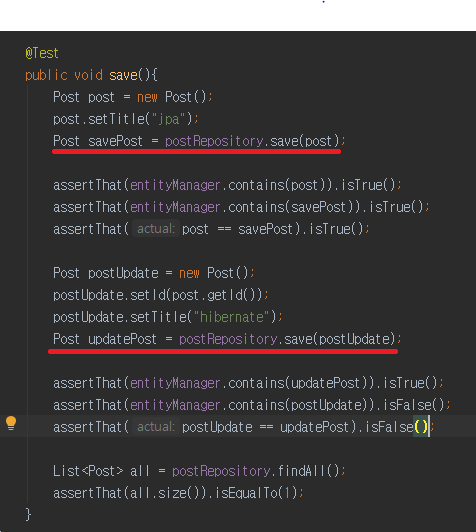;

---
#### 테스트 범위에 따라서 달라지는 결과
- @SpringBootTest
    - postRepository.save()에만 트랜잭션이 적용됨
    - 테스트 내에서는 entitymanager가 객체를 모른다.
- @DataJpaTest
    - 트랜잭션이 테스트 단위이다.
    - postRepository의 오퍼레이션과  EntityManager 모두 한 트랜잭션
    - entitymanager가 객체를 안다.
---


### 쿼리 메소드
#### 쿼리 생성하기
- [참고문서](https://docs.spring.io/spring-data/jpa/docs/current/reference/html/#jpa.query-methods.query-creation)
- And, Or
- Is, Equals
- LessThan, LessThanEqual, GreaterThan, GreaterThanEqual
- After, Before
- IsNull, IsNotNull, NotNull
- Like, NotLike
- StartingWith, EndingWith, Containing
- OrderBy
- Not, In, NotIn
- True, False
- IgnoreCase

#### 쿼리 찾아쓰기
- 엔티티에 정의한 쿼리 찾아 사용하기 JPA Named 쿼리
    - @NamedQuery
    - @NamedNativeQuery
- 리포지토리 메소드에 정의한 쿼리 사용하기
    - @Query
    - @Query(nativeQuery=true)
<br><br>

### Sort
- **이전과 마찬가지로 Pageable이나 Sort를 매개변수로 사용할 수 있는데, @Query와 같이 사용할 때 제약 사항이 하나 있다.**
- Sort는 그 안에서 사용한 프로퍼티 또는 alias가 엔티티에 없는 경우에는 예외가 발생합니다.
- Order by 절에서 함수를 호출하는 경우에는 Sort를 사용하지 못합니다. 그 경우에는 JpaSort.unsafe()를 사용 해야 합니다.
    - JpaSort.unsafe()를 사용하면 함수 호출을 할 수 있습니다.
    - JpaSort.unsafe(“LENGTH(firstname)”);
<br><br>
### Named Parameter과 SpEL
#### Named Parameter
- @Query에서 참조하는 매개변수를 ?1, ?2 이렇게 채번으로 참조하는게 아니라 이름으로 :title 이렇게 참조할 수 있다.
    ```
    @Query("SELECT p FROM Post AS p WHERE p.title = :title")
    List<Post> findByTitle(@Param("title") String title, Sort sort);
    ```

#### SpEL
- 스프링 표현 언어
- [참고문서](https://docs.spring.io/spring/docs/current/spring-framework-reference/core.html#expressions)
- @Query에서 엔티티 이름을 #{#entityName} 으로 표현할 수 있습니다.
    ```
     @Query("SELECT p FROM #{#entityName} AS p WHERE p.title = :title")
     List<Post> findByTitle(@Param("title") String title, Sort sort);
    ```
<br>

### Update 쿼리 메소드
#### Update 또는 Delete 쿼리 직접 정의하기
- 객체의 변화를 인지하고 데이터베이스에 동기화 (flush)
- update쿼리를 직접만들일이 별로 없다.
- 하지만 update가 자주 일어나는 경우, 만들어 쓸수 있다.(추천하진 않는다.)
    ```
    @Modifying
    @Query("UPDATE Post p SET p.title = ?2 WHERE p.id = ?1")
    int updateTitle(Long id, String title);
    ```
        
- 추천하지 않는 이유
    - 1차캐싱때문에 Persistent 상태의 객체를 select 하지 않고 그냥 가져온다.(트랜잭션이 끝나지 않았다.)
        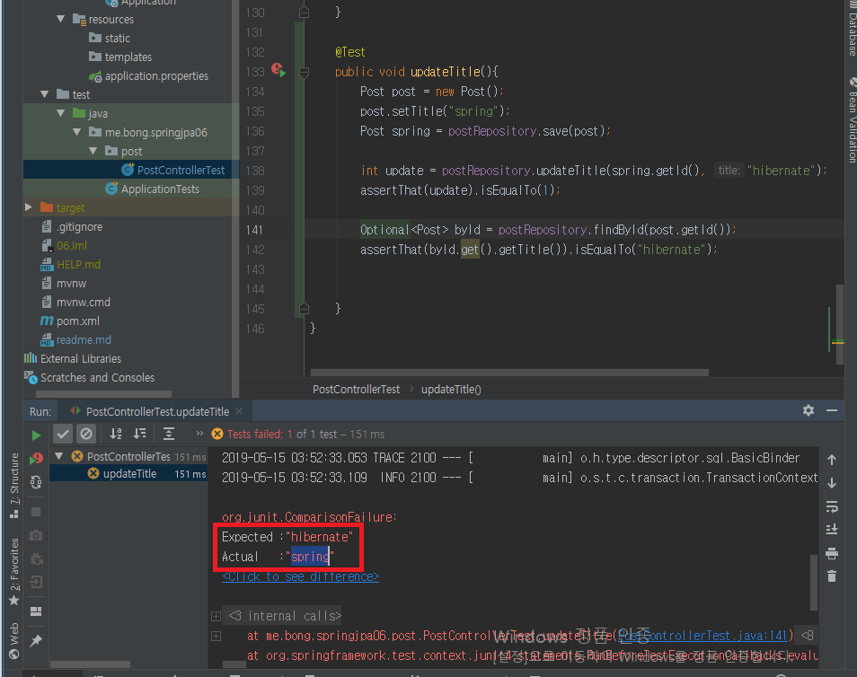
    - 문제를 해결하려면...
        - clearAutomatically = true
            - 실행 후, Persistent Context에 들어있던 캐쉬를 비워준다.   
            그래야 find할 때,  다시 새로 읽어온다.
        - flushAutomatically = true
            - 실행 전, Persistent Context상태를 flush 한다.   
            데이터 변경사항을 update하기위해
<br><br>

### EntityGraph
- 쿼리 메소드 마다 연관 관계의 Fetch 모드를 설정 할 수 있다.
- 예).. fetch = FetchType.LAZY를 기본으로 하되 필요한 경우에따라 EAGER로 사용하고 싶을때

#### @NamedEntityGraph
- @Entity에서 재사용할 여러 엔티티 그룹을 정의할 때 사용
    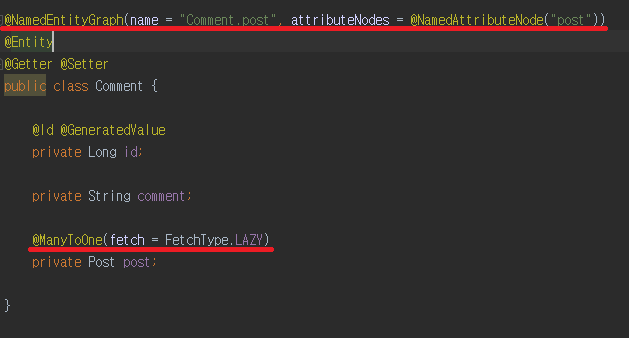
#### @EntityGraph
- @NamedEntityGraph에 정의되어 있는 엔티티 그룹을 사용 함.
    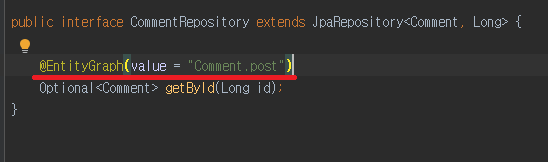
- 그래프 타입 설정 가능
    - (기본값) FETCH: 설정한 엔티티 애트리뷰트는 EAGER 패치 나머지는 LAZY 패치.
    - LOAD: 설정한 엔티티 애트리뷰트는 EAGER 패치 나머지는 기본 패치 전략 따름.
- @NamedEntityGraph 정의 되어있지않아도 attributePaths를 설정하여 사용할 수 있다.
    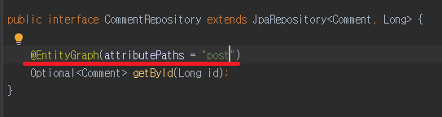
    
#### 비교 
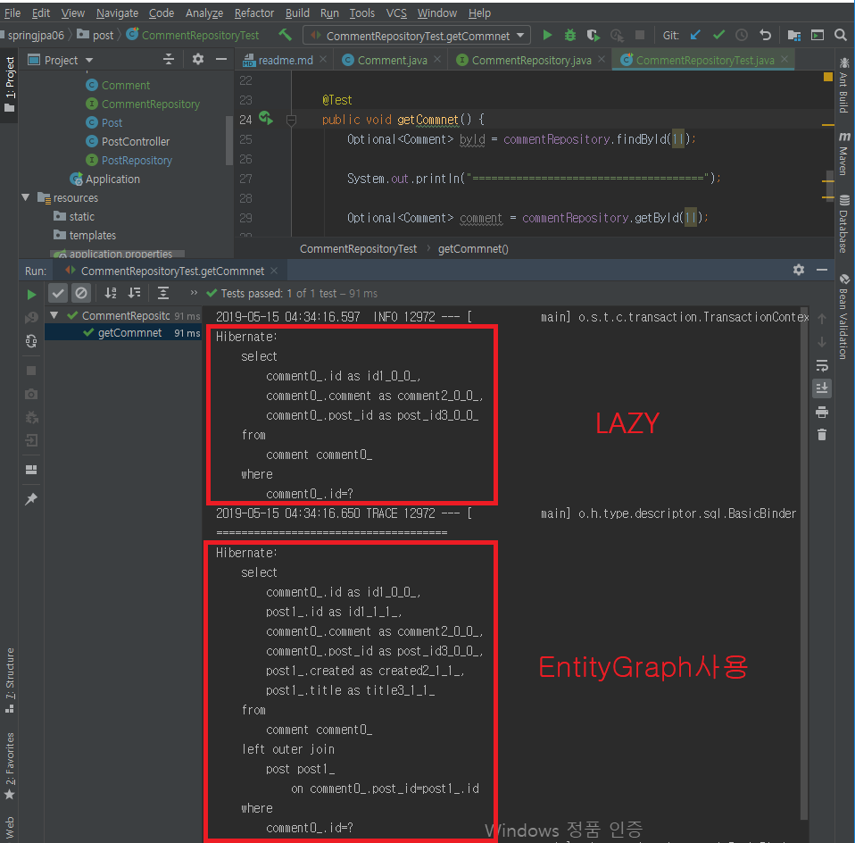
<br>

### Projection
- 엔티티의 일부 데이터만 가져오기.

#### 인터페이스 기반 프로젝션
- Nested 프로젝션 가능.
    - 인터페이스에 메소드 정의   
        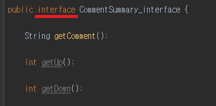
    - 타입을 해당 인터페이스 타입으로 변경
        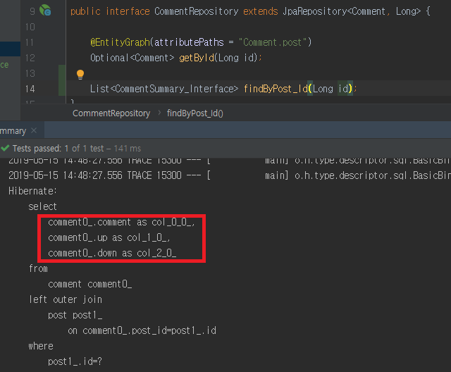    
- Open 프로젝션
    - @Value(SpEL)을 사용해서 연산을 할 수 있다. 스프링 빈의 메소드도 호출 가능.
    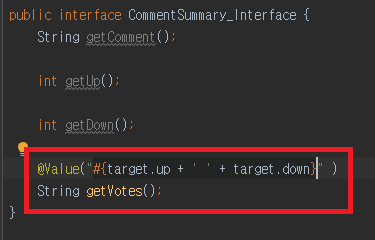
    - 쿼리 최적화를 할 수 없다. SpEL을 엔티티 대상으로 사용하기 때문에.
    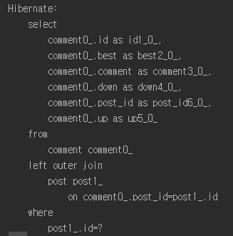
- Closed 프로젝션 (추천)
    - 쿼리를 최적화 할 수 있다. 가져오려는 애트리뷰트가 뭔지 알고 있으니까.
    - Java 8의 디폴트 메소드를 사용해서 연산을 할 수 있다.
    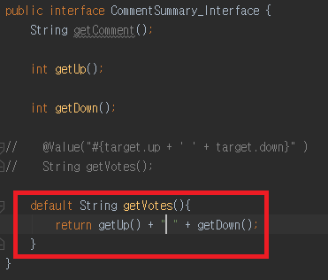
    

#### 클래스 기반 프로젝션
- DTO   
    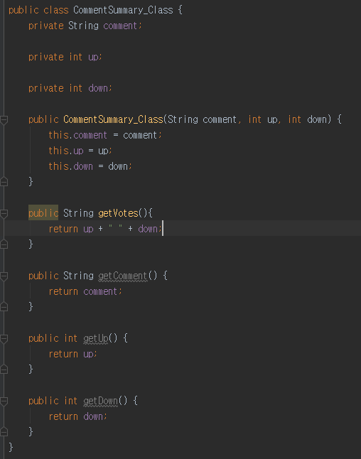
- 롬복 @Value로 코드 줄일 수 있음
    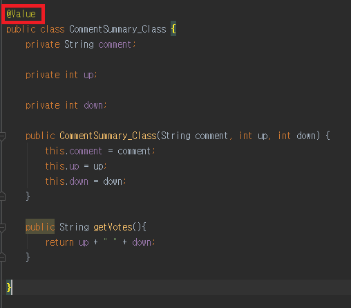

#### 다이나믹 프로젝션
- 프로젝션 용 메소드 하나만 정의하고 실제 프로젝션 타입은 타입 인자로 전달하기.
- 그러나 오버로딩이 안됨으로 제네릭을 사용하자.
    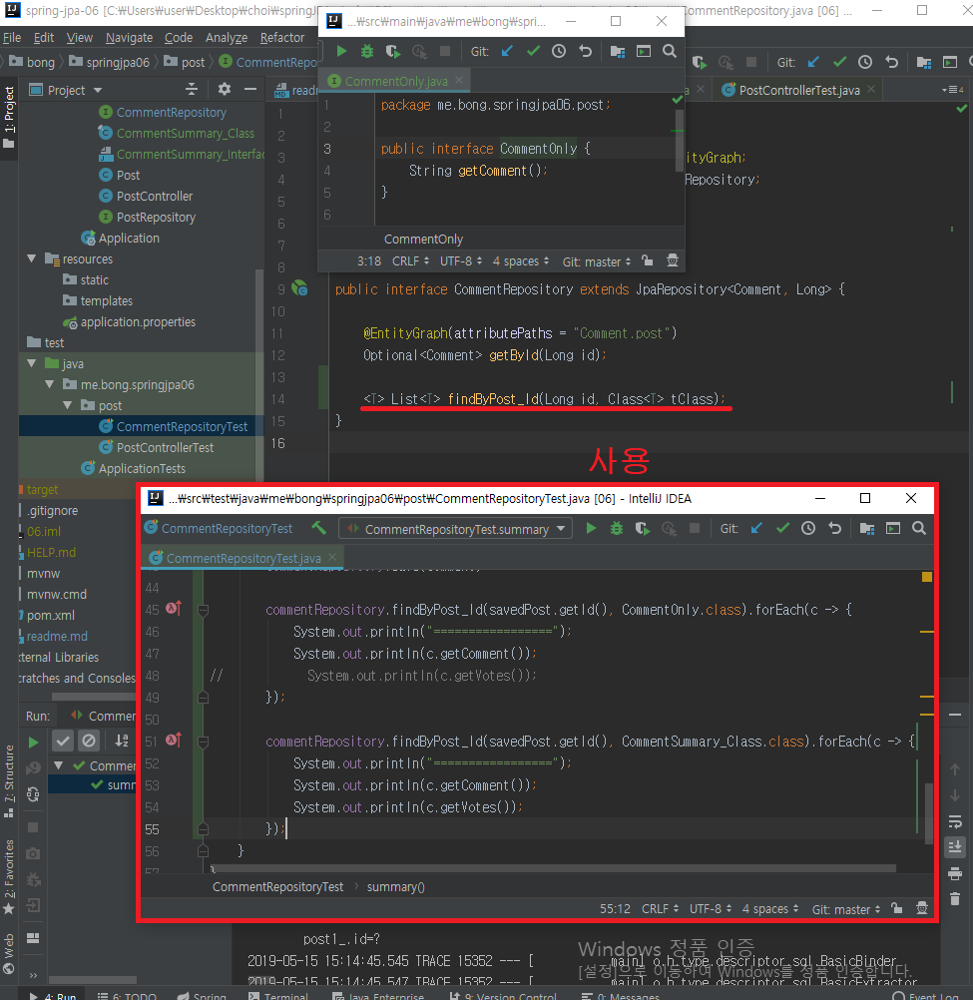
<br>

### Specifications
에릭 에반스의 책 DDD에서 언급하는 Specification 개념을 차용 한 것으로 QueryDSL의 Predicate와 비슷하다.
- 조건을 하나의 스펙으로 등록이 가능하다.

#### 설정
- [참고문서](https://docs.jboss.org/hibernate/stable/jpamodelgen/reference/en-US/html_single/)
- 의존성 설정
    ```
    <dependency>
        <groupId>org.hibernate</groupId>
        <artifactId>hibernate-jpamodelgen</artifactId>
    </dependency>
    ```
    
- 플러그인 설정
    ```
    <plugin>
        <groupId>org.bsc.maven</groupId>
        <artifactId>maven-processor-plugin</artifactId>
        <version>2.0.5</version>
        <executions>
            <execution>
                <id>process</id>
                <goals>
                    <goal>process</goal>
                </goals>
                <phase>generate-sources</phase>
                <configuration>
                    <processors>
                        <processor>org.hibernate.jpamodelgen.JPAMetaModelEntityProcessor</processor>
                    </processors>
                </configuration>
            </execution>
        </executions>
        <dependencies>
            <dependency>
                <groupId>org.hibernate</groupId>
                <artifactId>hibernate-jpamodelgen</artifactId>
                <version>${hibernate.version}</version>
            </dependency>
        </dependencies>
    </plugin>

    ```
    
- IDE에 애노테이션 처리기 설정
    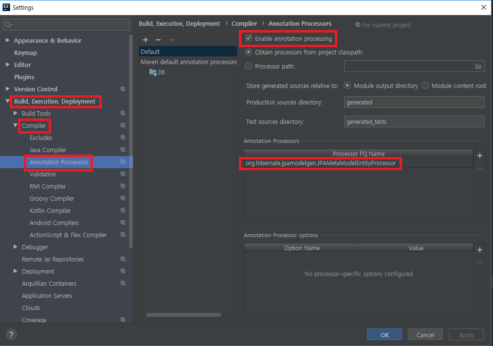
    - org.hibernate.jpamodelgen.JPAMetaModelEntityProcessor
    
#### 사용
- JpaSpecificationExecutor 상속 추가
    ```
    public interface CommentRepository extends JpaRepository<Comment, Long>, JpaSpecificationExecutor<Comment> {    
    }
    ```

- Spec 클래스
    ```
    public class CommentSpec {
    
        public static Specification<Comment> isBest(){
            return new Specification<Comment>(){
    
                @Override
                public Predicate toPredicate(Root<Comment> root, CriteriaQuery<?> criteriaQuery, CriteriaBuilder builder) {
    
                    return builder.isTrue(root.get(Comment_.best));
                }
            }; //여기서 root comment  코멘트가 베스트인지
        }
    
        public static Specification<Comment> isGood(){
            return new Specification<Comment>() {
                @Override
                public Predicate toPredicate(Root<Comment> root, CriteriaQuery<?> criteriaQuery, CriteriaBuilder builder) {
                    return builder.greaterThan(root.get(Comment_.up), 10);
                }
            }; // 코멘트의 up이 10개보다 큰것
        }
    }
    ```
    
    - 람다 사용 시
        ```
        public class CommentSpec {
        
            public static Specification<Comment> isBest(){
                return (Specification<Comment>)
                        (root, criteriaQuery, builder) -> builder.isTrue(root.get(Comment_.best)); //여기서 root comment  코멘트가 베스트인지
            }
        
            public static Specification<Comment> isGood(){
                return (Specification<Comment>)
                        (root, criteriaQuery, builder) -> builder.greaterThan(root.get(Comment_.up), 10); // 코멘트의 up이 10개보다 큰것
            }
        }
        ```
        
- test
    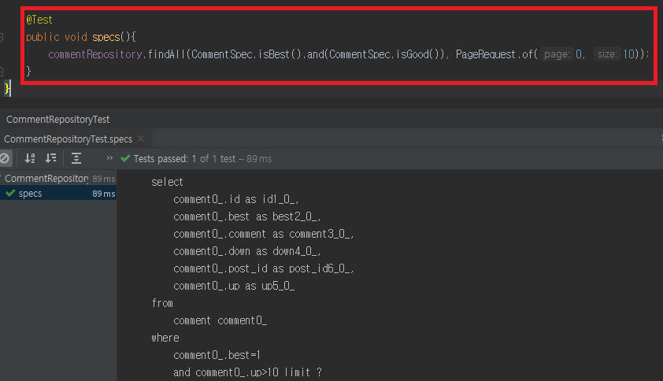
    - 여러 조건들에 대하여 조합도 가능하여, 메소드를 많이 늘리지 않고, 사용할 수 있어 편리하다.(단, 테스트는 필수이다.) 
<br>

### Query by Example
필드 이름을 작성할 필요 없이 단순한 인터페이스를 통해 동적으로 쿼리를 만드는 기능을 제공하는 사용자 친화적인 쿼리 기술입니다.
- [참고문서](https://docs.spring.io/spring-data/jpa/docs/current/reference/html/#query-by-example)
#### Example
- Example = Probe + ExampleMatcher
    - Probe는 필드에 어떤 값들을 가지고 있는 도메인 객체.
    - ExampleMatcher는 Prove에 들어있는 그 필드의 값들을 어떻게 쿼리할 데이터와 비교할지 정의한 것.
    - Example은 그 둘을 하나로 합친 것. 이걸로 쿼리를 함.
    
#### 사용방법
- Repository에 QueryByExampleExecutor 상속 추가
    ```
    public interface CommentRepository extends JpaRepository<Comment, Long>, QueryByExampleExecutor<Comment> {
    }
    ```
    
- 사용
    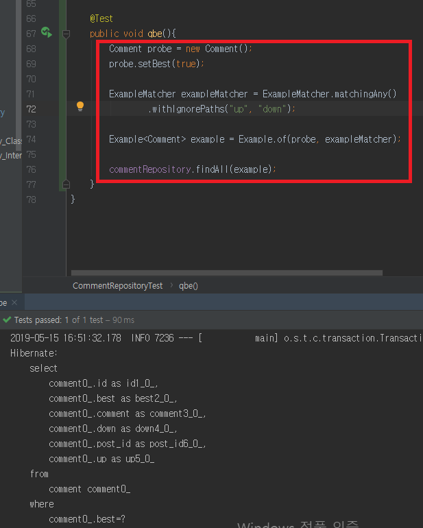
    
#### 장점
- 별다른 코드 생성기나 애노테이션 처리기 필요 없음.
- 도메인 객체 리팩토링 해도 기존 쿼리가 깨질 걱정하지 않아도 됨.(실질적으로는 아니다.)

#### 단점
- nested 또는 프로퍼티 그룹 제약 조건을 못 만든다.
- 조건이 제한적이다. 문자열은 starts/contains/ends/regex 가 가능하고 그밖에 propery는 값이 정확히 일치해야 한다.
   
**추천하지 않는다. QueryByDSL predicate 또는 Specification을 사용하는것을 추천한다.**
<br><br>

### 트랜잭션
- 스프링 프레임워크에서 지원하는 트랜잭션과 거의 유사하다.
- 기본적으로 Repository 메소드들은 기본적으로 @Transactional이 적용되어있다.

#### @Transactional
- [참고문서](https://docs.spring.io/spring-framework/docs/current/javadoc-api/org/springframework/transaction/annotation/Transactional.html)
- 클래스, 인터페이스, 메소드에 사용할 수 있으며, 메소드에 가장 가까운 애노테이션이 우선 순위가 높다.
- 기본적으로 RuntimeException 또는 Error 발생 시, 롤백을 한다.
    - checked Exception은 롤백 하지 않음.
        - 롤백을 시키고 싶다면 rollbackfor에 설정해주어야한다.
    - 롤백을 하고싶지 안핟면 norollbackfor등의 설정
- timeout 설정가능

- 트랜잭션 매니저 지정가능
    - JPA트랜잭션 매니저를 쓸 것이다.

- readoOnly (최적화 위해서 사용)
    - Flush 모드를 NEVER로 설정하여, Dirty checking을 하지 않도록 한다.
    > Dirty Checking이란 상태 변경 검사   
    JPA에서는 트랜잭션이 끝나는 시점에 변화가 있는 모든 엔티티 객체를 데이터베이스에 자동으로 반영해줍니다.

- Isolation
    - 여러개의 트랜잭션이 동시에 데이터에 접근했을 때, 설정
    - 기본값은 데이터베이스에 따라서 정해진다.
    - Read Uncommitted
        - 한 트랜잭션에서 커밋하지 않은 데이타에 다른 트랜잭션이 접근 가능하다. 즉, 커밋하지 않은 데이타를 읽을 수 있다.
        - 이 수준은 당연히 위에서 언급한 모든 문제에 대해 발생가능성이 존재한다. 대신, 동시 처리 성능은 가장 높다.
        - 발생 문제점 : Dirty Read, Non-Repeatable Read, Phantom Read
    - Read Committed
        - 커밋이 완료된 데이타만 읽을 수 있다.
        - Dirty Read가 발생할 여지는 없으나, Read Uncommitted 수준보다 동시 처리 성능은 떨어진다.  대신 Non-Repeatable Read 및 Phantom Read는 발생 가능하다.데이타베이스들은 보통 Read Committed를 디폴트 수준으로 지정한다.
        - 발생 문제점 : Non-Repeatable Read, Phantom Read
    - Repeatable Read
        - 트랜잭션 내에서 한번 조회한 데이타를 반복해서 조회해도 같은 데이타가 조회 된다
        - 이는 개별 데이타 이슈인 Dirty Read나 Non-Repeatable Read는 발생하지 않지만, 결과 집합 자체가 달라지는 Phantom Read는 발생가능하다.
        - 발생 문제점 : Phantom Read
    - Serializable
        - 가장 엄격한 격리 수준
        - 위 3가지 문제점을 모두 커버 가능하다. 하지만 동시 처리 성능은 급격히 떨어질 수 있다.
    - Isolation 관련 문제점
        - Dirty Read   
        한 트랜잭션(T1)이 데이타에 접근하여 값을 'A'에서 'B'로 변경했고 아직 커밋을 하지 않았을때, 다른 트랜잭션(T2)이 해당 데이타를 Read 하면?
        T2가 읽은 데이타는 B가 될 것이다. 하지만 T1이 최종 커밋을 하지 않고 종료된다면, T2가 가진 데이타는 꼬이게 된다.
        
        - Non-Repeatable Read   
        한 트랜잭션(T1)이 데이타를 Read 하고 있다. 이때 다른 트랜잭션(T2)가 데이타에 접근하여 값을 변경 또는, 데이타를 삭제하고 커밋을 때려버리면?
        그 후 T1이 다시 해당 데이타를 Read하고자 하면 변경된 데이타 혹은 사라진 데이타를 찾게 된다.
        
        - Phantom Read   
        트랜잭션(T1) 중에 특정 조건으로 데이타를 검색하여 결과를 얻었다. 이때 다른 트랜잭션(T2)가 접근해 해당 조건의 데이타 일부를 삭제 또는 추가 했을때, 아직 끝나지 않은 T1이 다시 한번 해당 조건으로 데이타를 조회 하면 T2에서 추가/삭제된 데이타가 함께 조회/누락 된다. 그리고 T2가 롤백을 하면? 데이타가 꼬인다

    - [참고, 출처 - wmJun](https://feco.tistory.com/45)
    
- Propagation
    - 트랜잭션을 어떻게 전파시킬 것 인지 대한 설정

>Dirty Checking(더티체킹)  시, 변경된 필드값만 updqte 하기위해서는 @DynamicUpdate를 사용한다.

<br>

### Auditing
- 엔티티의 변경 시점에 언제, 누가 변경했는지에 대한 정보를 기록하는 기능.

#### 스프링 데이터 JPA의 Auditing
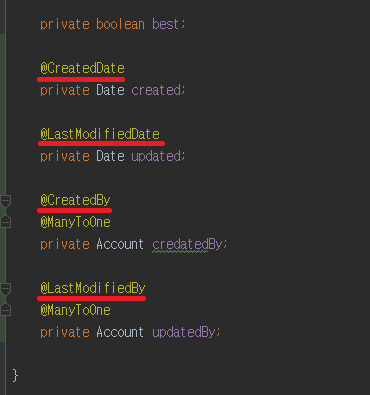

- 스프링 부트가 자동 설정 해주지 않는다.
- 엔티티 클래스 위에 @EntityListeners(AuditingEntityListener.class) 추가
    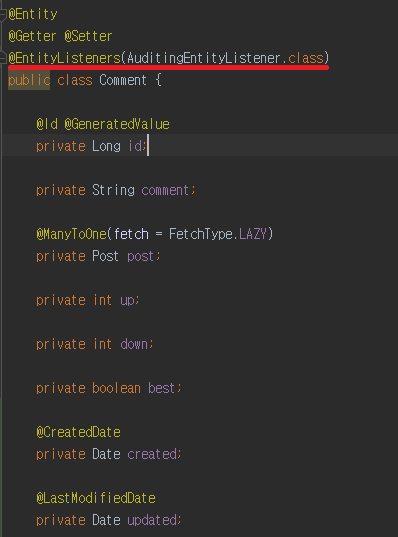
- AuditorAware 구현체 만들기   
    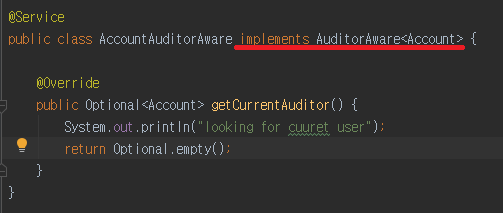
    - security를 사용하여 현재 유저정보를 가져올 수 있지만 print문으로 대체하였다.
- @EnableJpaAuditing 및 AuditorAware 빈 이름 설정하기.
    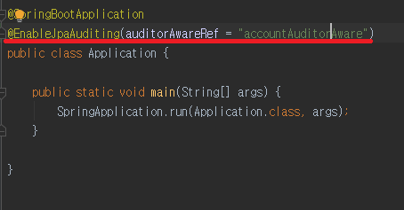
    > 빈 이름은 첫글자를 소문자로 변경한것이다.
    
#### 라이프 사이클 이벤트
- [참고문서](https://docs.jboss.org/hibernate/orm/4.0/hem/en-US/html/listeners.html)
- 엔티티에 변화가 일어났을 때, 특정한 콜백을 실행할 수 있는 이벤트를 발생시켜준다.
- @PrePersist
    - 엔티티가 저장이 되기전에 호출
    - 예)..
        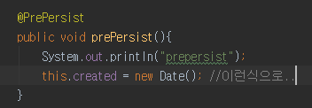
- @PreUpdate
- 여러개가 있다. 살펴보길..
<br><br>